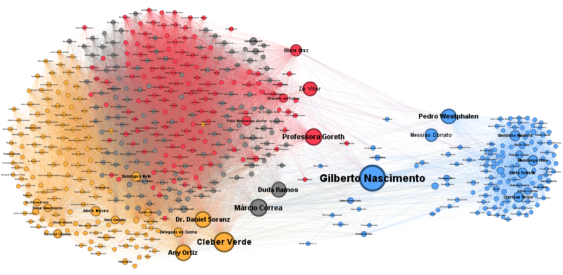

### The Intersection of Data and Political-Economic Analysis

As an aspiring economist, I understand that macroeconomic models and fiscal policies do not exist in a vacuum. The approval of a major economic anchor, such as the new Fiscal Framework (PLP 93/2023), relies heavily on institutional predictability and informal alliances. 

This project is a core part of my continuous learning journey in quantitative research. It represents my dedication to pushing my technical boundaries, bridging the gap between raw data science and advanced political-economic analysis.

---

### 1. Data Manipulation and Algebraic Modeling

The first step in this analysis involves accessing the Chamber of Deputies' Open Data API to systematically scrape all roll-call votes that led to the approval of the target proposition, forming the raw voting dataset.

To map tactical alliances accurately, we must filter out procedural noise and plenary absences. I quickly learned that relying on simple vote counting often misrepresents true party behavior and strategy. To solve this, I constructed relational matrices utilizing the **Jaccard Similarity Index**. 

Mathematically, this models the exact proportion of agreement between any two parliamentarians based on their shared votes. Since the cells of this adjacency matrix are filled with continuous similarity scores, I applied a structural threshold of 0.80 to the network. This ensures that only highly cohesive tactical alliances, where mutual voting agreement exceeds 80%, are mathematically projected onto the final topology:

$$J(A,B) = \frac{|A \cap B|}{|A \cup B|}$$

> **Technical Note on Data Cleaning & Institutional Rules:** A critical step in building the relational matrices was the rigorous treatment of missing data (NAs). Plenary absences and institutional abstentions—specifically those under Article 17 of the Chamber's Internal Regulations—were carefully isolated. Failing to separate these procedural nuances from actual "no" votes would mathematically distort the Jaccard Index, creating false proximity between parliamentarians who were simply absent and those actively opposing the agenda.

### 2. Unsupervised Clustering (Louvain Algorithm)

By applying the Louvain algorithm for community detection, the model revealed the invisible behavioral caucuses within the Congress. 

The results provided crucial insights for political risk assessment: the algorithm indicated a pragmatic fragmentation of the "Centrão" into two distinct negotiation masses, directly reflecting the transaction costs and the slicing of parliamentary amendments. Furthermore, it mathematically captured the opposition, highlighting the tactical union of ideological extremes (PL and PSOL) in resistance to the fiscal agenda.

### 3. Network Metrics and Stakeholder Identification

Using Gephi (ForceAtlas 2) for topological mapping, I extracted the **Betweenness Centrality** metric for the network. 

This calculation successfully identified the parliamentarians acting as strategic articulators, that is the literal bridges between rival blocs. For public policy forecasting, identifying these decision-makers is vital. Because they control the flow of negotiations and information, they hold the power to unlock or stall the formation of a majority for the country's economic agenda.

*(For detailed data tables, node-level metrics, and further analytical insights, please refer to the source code repository linked below.)*

 

*(Visualization of the legislative network and ideological groupings based on roll-call votes.)*
{fig-align="center" width="100%"}

---

### Technologies & Tools
*   **Languages & Packages:** R (dplyr, tidyr, purrr, httr, jsonlite, igraph, etc.).
*   **Software:** Gephi (ForceAtlas 2).
*   **Data Sources:** Chamber of Deputies Open Data API.

 

  <a href="https://github.com/fmblasco/legislative_network_analysis" target="_blank" class="btn btn-dark">View Source Code on GitHub</a>

